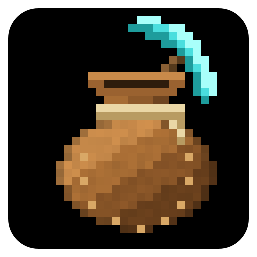
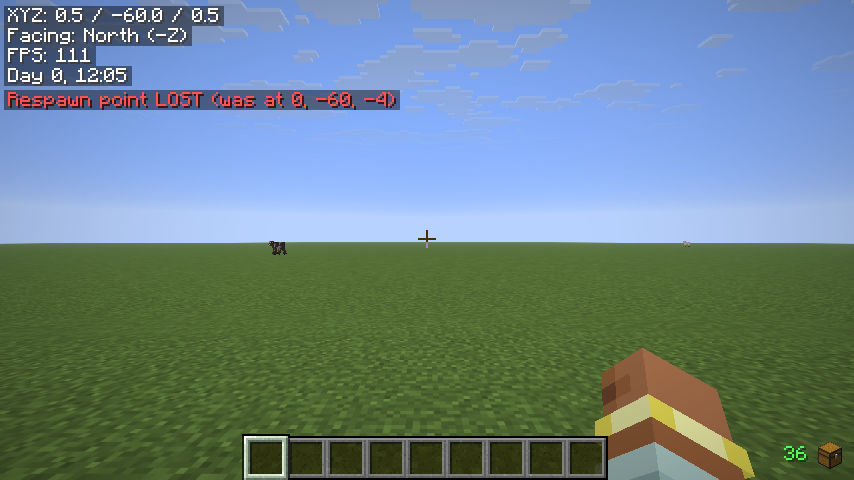
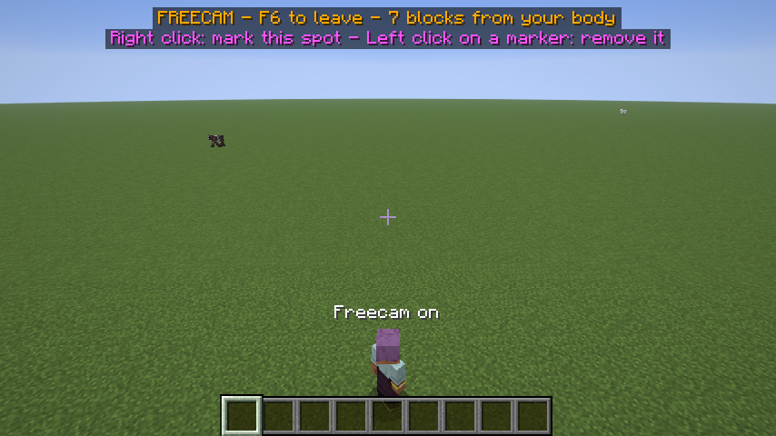
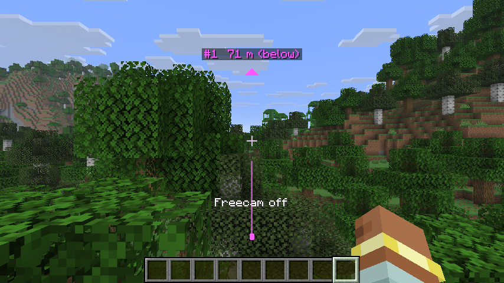
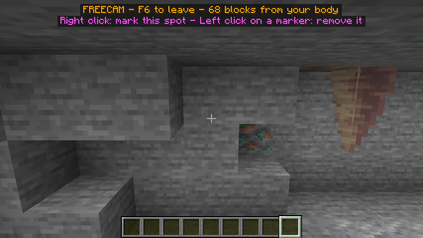

<h1 align="center">QoL Bundle</h1>

39 client-side quality-of-life modules in one mod, each with its own switch and settings.

39 个纯客户端的 QoL 小功能装进一个模组，每个都有自己的开关和设置。

<a href="#english">English</a> · <a href="#简体中文">简体中文</a>

  

# English

**In short**

- Dozens of small helpers in one mod; each one can be switched on or off.
- HUD info, survival warnings, chest memory and item search.
- Placement previews, redstone checks, PvP awareness and more.
- Client-side only. Press K in a world to open the settings.
- X-ray is a separate, optional add-on.

Everything else is in the folded sections below (features, how to use, settings, FAQ): click a title to open it.

QoL Bundle collects many small helpers in one Fabric mod: HUD information, survival warnings, chest memory and item search, placement previews, redstone diagnostics, PvP awareness and more. Every feature is a separate module with its own on/off switch and its own settings, so you keep only what you want.

- **Client-side only.** Nothing has to be installed on the server.
- **30 modules are on** when you first start the game, **9 start off**. A module that is switched off does nothing.
- **Grey zone.** Five modules (AFK Clicker, Freecam, Elytra One-Key Take-off, Water & Lava Vision, Rear-view Mirror) automate your own key presses or give you more than the normal view. They are off by default, sit in their own group in the settings, and are meant for single-player and your own server.
- **X-ray is not included.** It is a separate, optional add-on jar (see [below](#x-ray-add-on-separate-download)).
- English and Simplified Chinese.

<b>Features</b> (click to open)

### HUD and information

- **Info HUD** (on by default): Coordinates, facing with its axis (for example "North (-Z)"), FPS, and the in-game day and time in a screen corner. A real-world clock can be added, and the corner and text size can be changed.
- **Armor Durability HUD** (on by default): Your worn armor and held tools with their remaining durability (uses left, percent or both), coloured from green to red. A last row with a chest icon shows how many of your 36 inventory slots are still empty.
- **Break Progress** (on by default): While you mine, a small bar under the crosshair shows how far the block is broken, with the percentage and the seconds left.
- **Villager Trade Peek** (on by default): Look at a villager or wandering trader, no click needed, to see all its trades with prices, enchanted books by name, and how often each trade can still be used. The game only sends trades when you open the trading screen, so open it once per villager; the trades are then remembered until you leave the world.
- **Sound Compass** (on by default): Small pointers on a ring around the crosshair show where recent sounds came from, labelled with the subtitle text and "(above)" or "(below)" when needed. Dangerous sounds (creeper fuse, lit TNT, Warden, fireballs) get larger red pointers. It uses the same sounds as the game's subtitles, but subtitles do not need to be on.
- **Throw Landing Preview** (on by default): Holding an ender pearl, snowball, egg, splash or lingering potion, or bottle o' enchanting draws the flight arc and marks the landing spot. Potions show the area they will reach. Pearls get a traffic light: green for a clean landing, yellow when they hit a wall, red when they hit the ceiling or land at your feet.

### Survival and safety

- **Durability Alert** (on by default): When a held tool or a worn armor piece is down to 5% durability (adjustable), the screen edges flash red, a sound plays and a line names the item and the uses left. Each item warns once, and again only after it has been repaired.
- **Fall Damage Preview** (on by default): While you fall, a line shows how many hearts the landing will cost, turns red with "FATAL" when it would kill you, and says so when a totem in your hand will save you. It follows the game's own rules, including Feather Falling, Protection, Resistance, Slow Falling, Jump Boost and soft landings such as water, hay bales, slime blocks and beds.
- **Lava Safety Net** (on by default): Orange screen edges, a sound and a warning when there is open lava a few blocks below your feet (lava under a solid floor does not count). Once you are in lava, a green arrow points to the nearest spot where you can stand. It stays quiet in creative mode and with Fire Resistance.
- **Bed & Respawn Point Keeper** (on by default): Shows where you will respawn and how far away that is, tells you whether the bed you look at is yours, and gives a big warning with a sound when your bed is gone or your respawn anchor is empty. The server never tells your game where you respawn, so the mod learns it from the game's own messages; clicking a bed records it.
- **Escape Trail** (on by default, shown after you take damage; show/hide key not bound): Quietly remembers the last 30 seconds of the way you walked. When you get hurt, an orange arrow next to the crosshair leads back along that way, around the corners you took, and the path is drawn on the ground. It can also be shown all the time, or with a key.

### Travel and navigation

- **Portal Calculator** (on by default): Look at a nether portal to see the matching coordinates on the other side, which portal it will link to (or that a new one will be built), and whether the way back returns to the same portal. It only knows portals you have seen; they are remembered for each world and server.
- **Nether Roof Helper** (on by default): On top of the Nether ceiling (Y 128 and above): a heading tape at the top of the screen, Nether and Overworld coordinates side by side, and (with Portal Calculator on) what a portal built on the spot would link to. Type an Overworld destination into its settings and the tape points the way.
- **Elytra Dashboard** (on by default): While gliding: speed, vertical speed, pitch, height above ground, rockets left, remaining elytra flight time and the predicted landing spot, which is also marked in the world. The prediction assumes you keep looking the same way and use no more rockets.

### Building and placement

- **Placement Master** (on by default; hold Left Alt to lock): Three aids for placing blocks the right way round.
  - A see-through preview of the block exactly as it will be placed, with an arrow for the way it faces and a short text under the crosshair (for example "facing north · lower half").
  - With slabs, stairs and trapdoors, the half of the face you aim at is marked, so you know whether you get the upper or the lower half.
  - While you hold Left Alt, a block that would face a different way than the last block you placed is simply not placed; the preview turns green when it matches and red when it does not.
  - It only previews and holds back clicks. What your game sends is never changed.
- **Beacon & Conduit Range** (on by default): Look at a beacon or conduit, or hold one and aim where you want to place it, to see how far its effect reaches. Beacons show their real square column (worked out from the pyramid below), conduits their sphere (worked out from the frame).

### Chat and inventory

- **Chat Enhancements** (on by default; search key not bound): Four improvements, each with its own switch.
  - Timestamps in front of every chat line.
  - A gold [@] mark, a sound and a pop-up when someone mentions your name or one of your extra keywords. Private messages to you count too; your own messages do not.
  - Chat search: a Search button in the chat screen (or a key) lists every line of this session that contains what you type.
  - Chat survives a reconnect: rejoin the same world or server and the old chat is back above a divider line, and the Up arrow still recalls what you typed. This lasts until you close the game.
- **Multilingual Item Search** (on by default): A search box in the bottom-left corner of inventory and container screens (not the creative inventory, which has its own). Matching items get a green frame and the rest are dimmed. It finds items by English name, Chinese name or pinyin initials (zs = 钻石), whatever language your game uses; several words must all match.
- **Chest Memory** (on by default; search key not bound): Remembers what was in every chest, barrel, shulker box, hopper, dispenser, dropper and your ender chest the last time you opened it, separately for each world and server. Shulker boxes inside a chest are looked into too. Search for an item and click a result: a green arrow and a frame through walls lead you to that container.
- **Shulker Box Manager** (on by default): Every shulker box in an inventory gets a small colour tag for what it mostly holds (grey = building blocks, cyan = ores and ingots, red = redstone, orange = food, purple = tools and armor, pink = potions and enchanting, white = mixed) and a small picture of its main item. When you use the item search box, boxes that contain a match get an orange frame.
- **Recipe Book Helper** (on by default): Pick a recipe you cannot craft yet. The preview gets green frames on ingredients you have and red frames on missing ones, and a row above the window lists what is missing. Hover over a missing ingredient to see which shulker box you carry or which remembered chest has it; click it to be led to the nearest chest (uses Chest Memory).
- **Hotbar Layouts** (on by default; keys not bound): Save up to five named hotbar layouts (building, fighting, mining ...) and fetch the items from your backpack into place with one click or one key. Items you do not have are skipped; items are matched by type, not by enchantments.

### Combat and PvP awareness

Everything here that concerns other players only considers players you have a clear line of sight to: a player behind a wall never shows up. Invisible players and spectators are ignored, and the game's player-shaped mannequins count as players.

- **Attack Cooldown Bar** (on by default): While your weapon recharges, a bar under the crosshair fills from red to green with the ticks left next to it, and a soft click plays the moment your next hit is at full strength.
- **Shot Direction** (on by default): When an arrow, trident or other projectile hits you, a red arrow at the crosshair points to where it came from for 3 seconds. Only the direction of the shot is shown, not the shooter.
- **Kill Confirmation & Combat Stats** (on by default; reset key not bound): Shows "Kill confirmed" with a sound when something you hit dies within 5 seconds of your last hit, and keeps count of kills, damage dealt, damage taken and deaths. Works on mobs as well as players; the tally appears for a while after each fight.
- **Opponent Gear Panel** (on by default): Look at a player to see what they hold and wear, with enchantments, and whether they are drinking, eating, drawing a bow, loading a crossbow or blocking right now.
- **Approach Alert** (on by default): A sound and a yellow arrow when a player comes within 12 blocks from any side with nothing solid in between, for example sneaking up behind you. The arrow shows where they were at that moment and does not follow them; it is not a radar.
- **Being Watched** (on by default): A red warning and a sound when a player in front of you keeps their crosshair on you for more than 3 seconds.
- **Loot Timer** (on by default): A countdown over dropped items in plain sight until they disappear (items last 5 minutes). Your game is not told how old an item is, so the clock starts when it first sees the item; for items that were already lying there it is an upper limit, shown with "≤".

### Technical and redstone

- **Redstone Diagnostics** (on by default; keys F8, ] and [): Look at a redstone component and press F8. Everything connected to it is scanned as one machine (within 24 blocks by default) and kept up to date:
  - Signal flow: arrows along redstone dust and out of repeaters, comparators and observers, a red mark where a signal runs out and an orange one on a locked repeater.
  - Bottlenecks: hoppers locked by a redstone signal, the total repeater delay, the slowest repeating part, and a warning when more items drop than one hopper line can carry.
  - Overview: how many of each component there are and how many are powered, lit, extended or locked right now.
  - Output rate: dropped items at the machine counted per minute and per hour. For machines that fill a chest, open the chest once after scanning and again later.
  - Slices: ] and [ step through single layers of the machine, which are then shown through the blocks around them.
  - Press F8 while looking at the sky, or while sneaking, to clear everything.
- **Entity Counter** (off by default): Counts the entities your game has loaded, by kind, and lists the most common types. The dropped-items line turns yellow and then red with "LAG RISK" at 100 items (adjustable), and the biggest pile of dropped items is located. Only dropped items get a location, never mobs or players.

### Visuals and world overlays

- **Fullbright** (off by default): See in the dark as if you had Night Vision, without the potion effect or its icon. The brightness is adjustable.
- **Chunk Borders** (off by default): The chunk you stand in gets see-through coloured walls from the bottom to the top of the world, with height lines every 8 blocks near you and marks at the corners of the neighbouring chunks.
- **Slime Chunks** (off by default): Slime chunks around you get a see-through green layer on the ground and corner posts through the whole height of the world, and a line says whether you stand in one. It needs the world seed: in single-player it is read from the world, on a server you type it into the settings once (remembered for each server). Overworld only.

### Grey zone (off by default)

These are fine in single-player and on your own server. They press your own keys for you or show more than the normal view, so many public servers forbid them, and anti-cheat plugins may kick you (for Freecam in particular). They are listed under "Grey zone - careful on public servers" in the settings screen, and their keys only work after you switch them on there.

- **AFK Clicker** (key F7 starts and stops it): Locks your view and clicks or holds the attack or use button for you at a set pace, and stops at once when you get hurt. Presets: mob farm (swing a sword), fishing farm or eating (hold right), cobblestone generator (hold left), fast right click, and trading (one right click per second).
- **Freecam** (key F6): The camera leaves your body and flies freely (movement keys, Jump to rise, Sneak to sink, Sprint for triple speed) while your body stays where it is; clicks do nothing to the world. It shows only what your game has already loaded, lights up dark places while you fly, and ends when you get hurt.
  - **Markers (waypoints):** while flying, right-click to put a numbered pink marker on the block you look at, and left-click a marker to remove it. Back in your body, pink arrows around the crosshair and a beam in the world lead you to each marker; a marker disappears when you reach it. Markers are remembered for each world and server.
- **Elytra One-Key Take-off** (key V): Look up and press one key: it jumps, opens the elytra and fires a rocket from your hotbar or off hand, then switches back to the slot you had selected. Without rockets it only jumps and opens the elytra. It never turns your view for you.
- **Water & Lava Vision**: No fog under water, and inside lava you can make out the blocks around you (12 blocks by default).
- **Rear-view Mirror**: A small live picture of what is directly behind you in a screen corner, flipped left-right like a real mirror by default. The world is drawn twice per frame for it, so expect roughly half your usual frame rate.

### X-ray add-on (separate download)

X-ray is deliberately not part of QoL Bundle. Many servers ban X-ray, and not everyone wants it in their mods folder, so it ships as its own small mod, **QoL Bundle: X-ray add-on**. If you do not want it, simply do not install it: the main mod has no X-ray feature.

When the add-on is installed next to QoL Bundle, the module **X-ray (add-on)** appears in the Grey zone group of the settings screen (off by default, no key). Switched on, it outlines ores within 32 blocks through walls and ground, each ore in its own colour: diamond cyan, gold yellow, redstone red, lapis blue, emerald green, iron light brown, ancient debris brown. Coal, copper and nether quartz can be switched on, and any other block can be added by its id (for example `minecraft:spawner`). It only draws outlines on top of the world, can only see blocks your game has received, and is meant for single-player and your own server only.

## Screenshots

Info HUD in the top-left corner (coordinates, facing, FPS, in-game time) with the Bed & Respawn Point Keeper line below it, here warning that the recorded bed is gone. Bottom right: the free inventory slots counter of the Armor Durability HUD.

Freecam: the camera flies away from your body; the banner shows the key to leave and how far you are from your body.

Back in your body, a pink arrow and a beam lead to a spot you marked while flying.

Freecam lights up dark caves while you fly.

<b>How to use</b> (click to open)

### Opening the settings

- Press **K** while playing, or
- with [Mod Menu](https://modrinth.com/mod/modmenu) installed: **Mods → QoL Bundle → the settings button**. This also works from the title screen.

The settings screen lists every module under five headings: **Technical**, **Information**, **Tools**, **PvP awareness** and **Grey zone - careful on public servers**. Each row has the module's name and a short description, a **Settings...** button and an **ON/OFF** switch. Hover over the switch to read the full description.

**Settings...** opens the module's own page: the **Enabled** switch at the top, then its options (switches, sliders, buttons that cycle through choices, text boxes). Hover over an option for a longer explanation where there is one. **Reset to defaults** restores that module's options. Hotbar Layouts and Chest Memory also have an **Open** button for their own screen. Changes are saved automatically.

Where each module sits in the settings screen:

| Heading in the settings screen | Modules |
|---|---|
| Technical | Fullbright, Info HUD, Armor Durability HUD, Break Progress, Portal Calculator, Nether Roof Helper, Beacon & Conduit Range, Entity Counter, Chunk Borders, Slime Chunks, Redstone Diagnostics |
| Information | Fall Damage Preview, Bed & Respawn Point Keeper, Villager Trade Peek, Throw Landing Preview, Lava Safety Net, Escape Trail |
| Tools | Durability Alert, Elytra Dashboard, Sound Compass, Chat Enhancements, Multilingual Item Search, Hotbar Layouts, Chest Memory, Shulker Box Manager, Recipe Book Helper, Placement Master |
| PvP awareness | Attack Cooldown Bar, Loot Timer, Shot Direction, Kill Confirmation & Combat Stats, Opponent Gear Panel, Approach Alert, Being Watched |
| Grey zone - careful on public servers | AFK Clicker, Freecam, Elytra One-Key Take-off, Water & Lava Vision, Rear-view Mirror, X-ray (add-on, only when installed) |

### Default keys

| Action (as named in Controls) | Default key | Where to change it |
|---|---|---|
| Open QoL Bundle settings | K | Options → Controls → Key Binds → QoL Bundle |
| Start / stop the AFK clicker | F7 | Options → Controls → Key Binds → QoL Bundle |
| Toggle Freecam | F6 | Options → Controls → Key Binds → QoL Bundle |
| Elytra one-key take-off | V | Options → Controls → Key Binds → QoL Bundle |
| Placement: keep last orientation (hold) | Left Alt | Options → Controls → Key Binds → QoL Bundle |
| Diagnostics: scan the machine you look at / clear | F8 | Options → Controls → Key Binds → QoL Bundle |
| Diagnostics: next layer | ] | Options → Controls → Key Binds → QoL Bundle |
| Diagnostics: previous layer | [ | Options → Controls → Key Binds → QoL Bundle |
| Search chat history | not bound | Options → Controls → Key Binds → QoL Bundle |
| Search remembered chests | not bound | Options → Controls → Key Binds → QoL Bundle |
| Open hotbar layouts | not bound | Options → Controls → Key Binds → QoL Bundle |
| Apply hotbar layout 1 to 5 | not bound | Options → Controls → Key Binds → QoL Bundle |
| Clear Freecam markers | not bound | Options → Controls → Key Binds → QoL Bundle |
| Escape trail: show / hide the way back | not bound | Options → Controls → Key Binds → QoL Bundle |
| Combat stats: reset | not bound | Options → Controls → Key Binds → QoL Bundle |

Apart from K, a module's keys only work while that module is switched on. QoL Bundle has no chat commands.

### Common tasks

**Switch a module on or off**
1. Press K.
2. Find the module (see the table above) and click its ON/OFF button.

**Find an item in your chests (Chest Memory)**
1. Play normally: every container you open is remembered.
2. Press E and click **Chest memory** in the bottom-right corner (or bind "Search remembered chests").
3. Type an item name in English or Chinese, or its pinyin initials. Results show how many, how far away and how long ago you saw them; shulker boxes you carry are listed first.
4. Click a result. A green arrow and a frame lead you there; they go away when you open that container (or after 120 seconds).

**Craft something you lack ingredients for (Recipe Book Helper)**
1. Open the recipe book and click a recipe you cannot craft yet.
2. Red frames mark missing ingredients; the row above the window lists them.
3. Hover over a missing ingredient to see where it is, click it to be led to the nearest chest that has it.

**Save and apply a hotbar layout**
1. Arrange your hotbar the way you like it.
2. Press E, click **Hotbar layouts** (bottom right), give a row a name and click **Save**.
3. Later, click **Apply** on that row, or bind "Apply hotbar layout 1" to 5 to a key. Items are moved one per tick; missing items are skipped and counted in a message.

**Check a redstone machine (Redstone Diagnostics)**
1. Look at any redstone component of the machine and press **F8**. A panel appears in the top-left corner and marks appear on the machine.
2. Press **]** and **[** to look at one layer at a time; past the last layer you are back to the whole machine.
3. For output into a chest: open the output chest once after scanning, then again at least 20 seconds later (Chest Memory must be on).
4. Press **F8** at the sky or while sneaking to clear. If the machine was changed, the panel asks you to scan again.

**Place a row of blocks facing the same way (Placement Master)**
1. Place the first block, for example a stair, the way you want it.
2. Hold **Left Alt** while placing the next ones. A green preview means it will match; when it is red, the click is held back and nothing is placed.

**Use Freecam and markers (grey zone)**
1. Press K, switch on **Freecam** in the Grey zone group.
2. Press **F6** to fly out of your body. Right-click to mark blocks, left-click a marker to remove it.
3. Press **F6** again to return, then follow the pink arrows.

**Show slime chunks on a server**
1. Switch on **Slime Chunks**.
2. In single-player, leave the seed empty. On a server, type the world seed into **World seed**; it is remembered for that server.

**Share your settings**
1. Click **Copy share code** at the bottom of the settings screen. All switches and settings, including saved hotbar layouts, are copied as one line of text starting with `QOL1:`.
2. Your friend copies that line and clicks **Import share code**, then confirms. Things remembered per world (portals, respawn point, chests, Freecam markers) are not part of the code.

**Use the X-ray add-on**
1. Put the add-on jar next to QoL Bundle in your `mods` folder.
2. Press K and switch on **X-ray (add-on)** in the Grey zone group. Choose the ores in its settings.

<b>Settings</b> (click to open)

The most useful options. Every module has more; hover over an option in game to read what it does.

| Module | Option (as shown in game) | Default | What it does |
|---|---|---|---|
| Durability Alert | Warn at or below | 5% | Remaining durability that sets off the alert (1 to 50%). |
| Durability Alert | Remind again on every further use | Off | Warn again each time the item loses more durability. |
| Fullbright | Brightness | 100% | How bright dark places become (10 to 100%). |
| Info HUD | Position | Top left | Screen corner of the text. |
| Info HUD | Text size | 100% | 50 to 200%. |
| Info HUD | Real-world clock | Off | Adds the time of your computer's clock. |
| Armor Durability HUD | Show durability as | Uses left | Uses left, Percent or Both. |
| Armor Durability HUD | Show free inventory slots | On | The chest icon row with your empty slots. |
| Portal Calculator | Look distance (blocks) | 24 | How far away a portal is recognised. |
| Nether Roof Helper | Destination (Overworld x, z) | empty | For example `1200, -340`; marked on the heading tape. |
| Entity Counter | Warn at this many dropped items | 100 | The dropped-items line turns yellow at half and red at this number. |
| Chunk Borders | Color / Wall opacity | Yellow / 25% | Look of the walls; 8 colours to choose from. |
| Slime Chunks | World seed | empty | Needed on servers; in single-player leave it empty. |
| Slime Chunks | Range (chunks) | 4 | How many chunks around you are checked (1 to 8). |
| Fall Damage Preview | Also show when the landing is safe | Off | By default only shown when the landing will hurt. |
| Bed & Respawn Point Keeper | Tell whether the bed you look at is yours | On | The hint under the crosshair when you look at a bed. |
| Villager Trade Peek | Most trades to list | 10 | 3 to 16. |
| Lava Safety Net | How far below to look (blocks) | 5 | Depth of the open-lava warning (1 to 12). |
| Elytra Dashboard | Position | Below the crosshair | Or one of the four corners. |
| Elytra Dashboard | Rockets turn yellow at | 8 | Warning colour for the rocket count. |
| Sound Compass | Seconds a sound stays | 3 | 1 to 8. |
| Sound Compass | Ignore your own sounds | On | Hides your own footsteps and the like. |
| Chat Enhancements | Timestamps with seconds | Off | `[13:17:05]` instead of `[13:17]`. |
| Chat Enhancements | Extra words to watch for | empty | Comma-separated words that count as a mention. |
| Chat Enhancements | Keep chat after a reconnect | On | Brings the old chat back when you rejoin. |
| Multilingual Item Search | Match pinyin initials | On | Lets "zs" find 钻石 (diamond). |
| Chest Memory | Mark as possibly outdated after (days) | 7 | Older records are marked "(may be out of date)". |
| Chest Memory | Keep pointing for (seconds) | 120 | How long the arrow to a chest stays. |
| Shulker Box Manager | Search inside boxes | On | Orange frame on boxes that hold what you search for. |
| Recipe Book Helper | Green / red frames on the recipe preview | On | Marks which ingredients you have. |
| Placement Master | Preview which blocks | Only blocks with a direction | Or All blocks. |
| Placement Master | Preview opacity | 55% | 20 to 90%. |
| Placement Master | Orientation lock (hold the key) | On | The Left Alt lock. |
| Redstone Diagnostics | Scan range (blocks) | 24 | How far from the first component the scan reaches (8 to 48). |
| Redstone Diagnostics | Slice direction | Layers by height (Y) | Or slices east-west (X) / north-south (Z). |
| Escape Trail | How much of the way to remember | 30 s | Seconds of walking (10 to 120); standing still does not use it up. |
| Escape Trail | When to show | After taking damage | Or Always. |
| Escape Trail | Stay visible after damage for | 15 s | 5 to 60 s. |
| Attack Cooldown Bar | Sound volume | 30% | Volume of the "ready" click. |
| Loot Timer | Range (blocks) | 16 | 4 to 32. |
| Kill Confirmation & Combat Stats | Always show | Off | Keep the tally on screen all the time. |
| Opponent Gear Panel | Range (blocks) | 32 | 8 to 64. |
| Approach Alert | Alert distance (blocks) | 12 | 4 to 32. |
| Approach Alert | Only sneaking players | Off | Ignore players who are not sneaking. |
| Being Watched | After how long | 3 s | 1 to 10 s. |
| AFK Clicker | Preset | Custom (use the two settings below) | Ready-made setups for common farms. |
| AFK Clicker | Ticks between clicks | 10 | 20 ticks = 1 second (used with the Custom preset). |
| AFK Clicker | Stop when hurt | On | Stops at the first damage. |
| Freecam | Flying speed (blocks per tick) | 0.5 | 0.1 to 3.0; hold Sprint for three times as fast. |
| Freecam | Leave when hurt | On | Returns you to your body when you take damage. |
| Freecam | Most markers at once | 10 | The oldest marker makes room (1 to 30). |
| Water & Lava Vision | How far you see in lava (blocks) | 12 | 4 to 32. |
| Rear-view Mirror | Size (share of the screen width) | 28% | 10 to 50%. |
| Rear-view Mirror | Left-right like a real mirror | On | Off shows the view as if you turned round. |
| X-ray (add-on) | Range (blocks) | 32 | 8 to 64. |
| X-ray (add-on) | Most outlines at once | 400 | When there are more, the nearest are shown (50 to 2000). |
| X-ray (add-on) | Extra blocks | empty | Block ids separated by commas, e.g. `minecraft:spawner,minecraft:chest`. |

Settings are stored in `config/qolbundle.json`. If that file is damaged, the defaults are used and the damaged file is kept as `qolbundle.json.broken`. Things remembered per world (portals seen, respawn point, chest contents, slime chunk seed, Freecam markers) are stored in `config/qolbundle/worlds/`, one file per world or server.

## Requirements

There is a separate jar for each Minecraft version:

| Minecraft | QoL Bundle | X-ray add-on (optional) | Java | Fabric Loader |
|---|---|---|---|---|
| 1.21.11 | `qolbundle-0.1.0.jar` | `qolbundle-xray-addon-0.1.0.jar` | 21 or newer | 0.19.5 or newer |
| 26.1, 26.1.1, 26.1.2 | `qolbundle-0.1.0+26.1.2.jar` | `qolbundle-xray-addon-0.1.0+26.1.2.jar` | 25 or newer | 0.19.5 or newer |

| | |
|---|---|
| [Fabric API](https://modrinth.com/mod/fabric-api) | required, for the same Minecraft version |
| [Mod Menu](https://modrinth.com/mod/modmenu) | optional, adds a settings button to the mod list (built against 17.0.1) |
| QoL Bundle: X-ray add-on | optional, separate jar; needs QoL Bundle (use the same version) |

QoL Bundle runs on the client only. The server does not need it, and the mod does not add any network channel of its own.

<b>Compatibility</b> (click to open)

- **Sodium, Iris and shader packs:** not fully tested yet. If something looks wrong, these are the most likely places: the see-through block of Placement Master, the Rear-view Mirror, the underground view of Freecam (it works differently when Sodium is installed), and the lines and walls drawn into the world (chunk borders, slime chunks, landing markers, X-ray outlines). Fullbright may have no effect while a shader pack is active.
- **Multiplayer:** so far tested in single-player only. Modules that read server messages or other players (respawn point, chat mentions, portal links, the PvP modules) may behave differently on servers with unusual plugins.
- **Other mods:** a mod with its own Freecam or a utility client should not run its Freecam at the same time as this one. Other chat mods that add timestamps or keep chat history can overlap with Chat Enhancements; switch off the matching option. The item search box sits in the bottom-left corner of the screen so it does not cover buttons other mods put next to the inventory.
- **Keys:** K, F6, F7, F8, V, Left Alt, [ and ] may already be used by other mods. Rebind them under Options → Controls → Key Binds → QoL Bundle.
- **What is sent to the server:** Placement Master never changes what is sent; it only holds back a click. Hotbar Layouts moves items with ordinary inventory clicks, one per tick. The AFK Clicker presses your own attack and use keys; Elytra One-Key Take-off presses your jump key and uses a rocket just like a right click would.

## Installation

1. Install [Fabric Loader](https://fabricmc.net/use/) 0.19.5 or newer for your Minecraft version.
2. Download [Fabric API](https://modrinth.com/mod/fabric-api) for that Minecraft version and put it into your `mods` folder.
3. Download the QoL Bundle jar for your Minecraft version (see the table under Requirements) and put it into the same `mods` folder.
4. Optional: [Mod Menu](https://modrinth.com/mod/modmenu) for a settings button in the mod list.
5. Optional, only if you want X-ray: the X-ray add-on jar for the same Minecraft version.
6. Start the game and press **K** in a world.

<b>FAQ</b> (click to open)

**Does the server need QoL Bundle?**
No. It is client-side only and works on servers that do not have it.

**Can I use it on public servers?**
Most modules only show information your game already has, and the PvP modules never look through walls. Server rules differ, though. The grey-zone modules and the X-ray add-on are meant for single-player and your own server; many public servers forbid them. When in doubt, ask the server staff.

**A key does nothing.**
Switch the module on first (press K). Then check Options → Controls → Key Binds for a key used twice.

**My screen is too busy.**
Switch off the modules you do not need. Text from several modules stacks in the screen corners without overlapping; text in the top corners is hidden while the F3 screen is open, and F1 hides everything.

**Portal Calculator says a new portal will be built, but there is one.**
Your game only knows the dimension you are in, so the mod only knows portals you have seen. Go through once and it remembers the other side.

**Villager Trade Peek says "No data yet".**
Open that villager's trading screen once. The server only sends trades when you do.

**Slime Chunks asks for a seed.**
Servers do not send the world seed. Type it into the module's settings once; in single-player it is read automatically.

**Can I copy my settings to another computer or give them to a friend?**
Yes, with **Copy share code** and **Import share code** at the bottom of the settings screen.

<b>Known limitations</b> (click to open)

- Version 0.1.0 has been tested in single-player. It has not yet been tested on public servers or in depth with Sodium, Iris or shader packs. The PvP modules have not yet been tried in real fights against other players.
- Placement Master: chests, beds, signs, banners and similar blocks get only the outline and the arrow, no see-through block.
- The Rear-view Mirror roughly halves your frame rate. Freecam also costs some frame rate while flying, because everything around the camera is drawn, even underground.
- Freecam, Entity Counter, Chest Memory and the X-ray add-on only know what your game has loaded or what you have opened. Chunks far from your body stay empty in Freecam.
- Redstone Diagnostics cannot see inside hoppers and chests you have not opened, cannot read a comparator's output strength, and measures very fast clocks (under 4 game ticks) inaccurately. It has mostly been tried on small machines.
- Recipe Book Helper was mainly checked on the 2×2 crafting grid of the inventory; the crafting table and furnace use the same code.
- Kill Confirmation counts a kill when the target dies within 5 seconds of your last hit, so another player's finishing blow can count as yours. "Damage dealt" is wrong on servers that hide other players' health; kills are still counted.
- Chat mentions are found by the usual chat formats ("name: message", "<name> message" and similar); servers with unusual formats may not be recognised.
- The respawn point is worked out from the game's messages. Servers that change how beds work may confuse it.
- Shulker Box Manager's colour tags are a rough guess from item names; some items may land in the wrong group.
- Chat history and villager trades are kept in memory only: chat until you close the game, trades until you leave the world.
- Elytra Dashboard counts flight time as one durability point per second, so with Unbreaking you can fly longer than shown.
- Fall Damage Preview assumes you drop straight down; it does not predict sideways movement.

## Credits

- Made by Autyism.
- Built on [Fabric](https://fabricmc.net/) Loader and Fabric API; optional settings button through [Mod Menu](https://modrinth.com/mod/modmenu) by TerraformersMC.
- The pinyin initials table used by the item search was generated with [pypinyin](https://github.com/mozillazg/python-pinyin) (MIT License).

## License

`GPL-3.0`. QoL Bundle and the X-ray add-on are free software under the GNU General Public License v3.0: you may use, share and change them, and changed versions you share must stay under the same license. See [LICENSE](LICENSE).

# 简体中文

**QoL 全家桶（QoL Bundle）**

**一句话看懂**

- 一个模组里几十个小功能，每个都能单独开关。
- HUD 信息、生存提醒、箱子记忆和物品搜索。
- 放置预览、红石诊断、PvP 提示等等。
- 纯客户端。进世界后按 K 打开设置。
- X-ray 是单独的可选附属包。

详细说明都在下面折叠起来的部分（功能、使用方法、设置、常见问题），点标题就能展开。

QoL 全家桶把很多实用小功能放进了同一个 Fabric 模组：HUD 信息、生存预警、箱子记忆和物品搜索、放置预览、生电诊断、PvP 信息等等。每个功能都是一个独立模块，有自己的开关和设置，用不上的关掉就行。

- **纯客户端。** 服务器不用装任何东西。
- **30 个模块默认开启**，**9 个默认关闭**（第一次启动游戏时）。关掉的模块什么都不做。
- **灰档。** 有 5 个模块（AFK 自动操作器、Freecam 自由视角、鞘翅一键起飞、水下 / 岩浆可视增强、后视镜）会替你按下你自己的按键，或者让你看到比平时更多的东西。它们默认关闭，在设置界面里单独一组，只适合单人和自建服。
- **不含 X-ray。** X-ray 是一个单独的可选附属包（见下文"X-ray 附属包"一节）。
- 支持英文和简体中文。

<b>功能</b>（点开查看）

### HUD 与信息显示

- **信息 HUD**（默认开）：在屏幕角落显示坐标、朝向（带轴向，例如"北（-Z）"）、FPS、游戏内第几天几点。可以加一行现实时间，位置和字号都能调。
- **盔甲耐久 HUD**（默认开）：显示身上盔甲和手持工具的剩余耐久（剩余耐久、百分比或两个都显示），颜色从绿到红。最下面一行是一个箱子图标加数字，表示背包（含快捷栏，共 36 格）还空着几格。
- **破坏进度**（默认开）：挖方块时准星下方出现一条进度条，带百分比和剩余秒数。
- **村民交易透视**（默认开）：看着村民或流浪商人，不用右键，就能看到它的全部交易、价格、附魔书是什么附魔、还能换几次。服务器只在你打开交易界面时才把交易发给你，所以每个村民要先打开一次；之后在离开这个世界之前都记得。
- **声音方向罗盘**（默认开）：准星周围一圈小箭头指出刚才的声音从哪个方向来，旁边写着是什么声音，在头顶或脚下时加"（上方）/（下方）"。危险的声音（苦力怕嘶嘶声、点燃的 TNT、监守者、火球）用更大的红色箭头。它用的就是原版字幕（隐藏式字幕）里的那些声音，但不需要打开字幕。
- **投掷物落点**（默认开）：手持末影珍珠、雪球、鸡蛋、喷溅药水、滞留药水或附魔之瓶时，画出抛物线并标出落点。药水会显示影响范围。珍珠有红绿灯：绿 = 落点正常，黄 = 会撞墙，红 = 会撞到头顶或落在脚边。

### 生存与安全

- **耐久报警**（默认开）：手上的工具或身上的盔甲耐久掉到 5%（可调）时，屏幕边缘闪红、响提示音，并显示物品名和剩余耐久。每件装备只提醒一次，修好之后再掉下来才会再提醒。
- **落地伤害预告**（默认开）：下落时显示落地会扣几颗心；会摔死时变红并写"会死"，手里有不死图腾时提示"图腾会救你"。算法和游戏一样，摔落缓冲、保护、抗性提升、缓降、跳跃提升，以及水、干草捆、黏液块、床这类软着陆都算进去了。
- **岩浆安全网**（默认开）：脚下几格内有敞开的岩浆时，屏幕边缘变橙、响一声并显示警告（隔着实心地板的岩浆不算）。掉进岩浆后，一个绿色箭头指向最近能站的地方。创造模式和有抗火效果时不提示。
- **床与重生点管家**（默认开）：显示你的重生点在哪、离你多远；看着床时提示是不是你的床；床没了或重生锚没电时大字警告并响一声。服务器从不把重生点告诉客户端，所以模组是从游戏自己的提示消息里推断的：右键一下床就会记录。
- **逃跑轨迹**（默认开，受伤后显示；"显示 / 收起退路"键默认没绑）：一直悄悄记着你最近 30 秒走过的路。受伤时准星旁出现一个橙色箭头，沿着你来的路往回指，拐过的弯也照着拐，地上同时画出来路。也可以改成一直显示，或者用按键随时调出来。

### 出行与导航

- **传送门计算器**（默认开）：看着下界传送门，显示另一边的对应坐标、会连到哪个门（或者会新建一个），以及回程会不会回到这个门。它只认得你亲眼见过的门，按存档 / 服务器分开记住。
- **下界顶层辅助**（默认开）：在下界基岩顶上（Y 128 及以上）时：屏幕顶部一条方向带、下界和主世界坐标并排显示，以及（开着传送门计算器时）在这里搭门会连到哪。在设置里填一个主世界目的地，方向带就会指给你看。
- **鞘翅飞行仪表盘**（默认开）：滑翔时显示速度、升降速度、俯仰角、离地高度、烟花余量、鞘翅还能飞多久，以及预计落点（世界里也会标出来）。预计落点按"保持当前视角、不再放烟花"来估算。

### 建筑与放置

- **放置大师**（默认开；按住左 Alt 锁定）：三个帮你把方块放对方向的功能。
  - 半透明预览：显示方块放下去以后的真实样子，有一个箭头表示朝向，准星下方还有一行字（例如"朝北 · 下半"）。
  - 拿着半砖、楼梯、活板门对着方块侧面时，会标出你瞄着的是上半还是下半，瞄哪半就放哪半。
  - 按住左 Alt 时，如果这一下放出来的朝向和你上一个放的方块不一样，就干脆不放；预览变绿表示一致，变红表示不一样。
  - 它只做预览和拦截，绝不修改发给服务器的东西。
- **信标 / 潮涌范围**（默认开）：看着信标或潮涌核心，或者手里拿着一个对着想放的位置，就能看到效果能覆盖多远。信标按下面的金字塔算出真实的方柱范围，潮涌核心按框架算出球形范围。

### 聊天与背包

- **聊天增强**（默认开；"搜索聊天记录"键默认没绑）：四个小功能，各有开关。
  - 聊天栏每一行前面加时间戳。
  - 有人提到你的名字或你设置的关注词时，那一行前面加金色的 [@]，响一声并弹出提示。私聊也算；你自己说的话不算。
  - 聊天搜索：聊天界面里的"搜索"按钮（或按键）能列出本次游戏里包含你输入内容的所有聊天行。
  - 断线重连保留聊天：重新进入同一个存档或服务器时，之前的聊天会回来，显示在一条分隔线上方；按上箭头还能翻出自己发过的话。关掉游戏就没了。
- **多语言物品搜索**（默认开）：背包和箱子类界面的屏幕左下角多一个搜索框（创造模式物品栏有自己的搜索，所以不加）。匹配的物品加绿框，其余变暗。英文名、中文名、拼音首字母（zs = 钻石）都能搜，不管游戏语言是什么；多个词用空格隔开表示都要满足。
- **箱子记忆**（默认开；搜索键默认没绑）：记住你每次打开的箱子、木桶、潜影盒、漏斗、发射器、投掷器和末影箱里有什么，按存档 / 服务器分开存。箱子里放着的潜影盒也会看进去。搜索物品后点一下结果，绿色箭头和隔墙可见的绿框会带你找到那个容器。
- **潜影盒管家**（默认开）：背包和箱子界面里，每个潜影盒都有一个小色块表示里面主要装的是什么（灰 = 建筑方块，青 = 矿物和锭，红 = 红石，橙 = 食物，紫 = 工具和盔甲，粉 = 药水和附魔，白 = 混装），以及一个主要物品的小图标。用物品搜索框搜索时，里面有匹配物品的盒子会加橙色框。
- **合成书增强**（默认开）：在合成书里点一个现在做不了的配方，预览上有的材料加绿框、缺的材料加红框，窗口上方列出缺什么。鼠标移到缺的材料上能看到哪个随身潜影盒或哪个记住的箱子里有；点一下就带你去最近的那个箱子（需要箱子记忆）。
- **快捷栏配置切换**（默认开；按键默认没绑）：最多保存五套可以命名的快捷栏布局（建筑、战斗、挖矿……），点一下或按一个键就把背包里的物品整理到快捷栏对应位置。背包里没有的物品直接跳过；只按物品种类匹配，不管附魔。

### 战斗与 PvP 信息

这一组里所有涉及其他玩家的功能，都只看你和他之间没有遮挡的玩家：隔着墙的玩家永远不会显示。隐身的玩家和旁观者会被忽略；游戏自带的玩家模型（mannequin）也算玩家。

- **攻击冷却条**（默认开）：武器蓄力时准星下方有一条进度条，从红变到绿，旁边写着还差几个 tick；蓄满的一瞬间有一声轻响。
- **弹道来向**（默认开）：被箭、三叉戟等弹射物打中时，准星旁出现一个红色箭头，指向它飞来的方向，持续 3 秒。只显示方向，不显示射手。
- **击杀确认与战损统计**（默认开；"战损统计：清零"键默认没绑）：你打过的目标在你最后一击后 5 秒内死亡，会提示"击杀确认"并响一声；同时累计击杀数、造成伤害、承受伤害和阵亡次数。对怪物和玩家都有效，统计在每次战斗后显示一会儿。
- **对手装备情报**（默认开）：看向一个玩家，显示他手里拿的、身上穿的和附魔，以及他是不是正在喝药、吃东西、拉弓、上弩或举盾。
- **接近警报**（默认开）：有玩家从任何方向靠近到 12 格以内、且中间没有实心方块时（比如从背后摸过来），响一声并出现黄色箭头。箭头只指他在那一刻的位置，不会一直跟着他，不是雷达。
- **被盯上检测**（默认开）：你面前的玩家准星一直对着你超过 3 秒时，屏幕上方出现红字提示并响一声。
- **抢夺倒计时**（默认开）：看得见的掉落物头上显示还有多久消失（掉落物 5 分钟消失）。游戏不会告诉客户端掉落物存在了多久，所以从你第一次看到它开始计时；对你来之前就躺在那的东西只是上限，用"≤"表示。

### 生电与红石

- **生电诊断台**（默认开；F8、] 和 [）：对着一个红石元件按 F8，和它连着的东西会被当成一台机器扫描下来（默认 24 格范围），之后实时更新：
  - 信号流向：红石线上和中继器、比较器、侦测器的输出方向画箭头；信号衰减没了的地方用红框标出，被锁住的中继器用橙框标出。
  - 瓶颈诊断：被红石信号锁住的漏斗、中继器延迟合计、重复得最慢的元件；掉落物多到一条漏斗线运不完时给出警告。
  - 元件状态总览：每种元件有几个，现在有几个通电、亮着、伸出或被锁。
  - 产率统计：统计机器这里出现的掉落物，折算成每分钟 / 每小时。产物直接进箱子的机器：扫描后打开一次输出箱，过一会再打开一次。
  - 切片：按 ] 和 [ 一层一层地看，选中的那一层会隔着周围的方块显示出来。
  - 对着天空或潜行时按 F8，全部清除。
- **实体计数仪表盘**（默认关）：按种类统计客户端已加载的实体，并列出数量最多的几种。掉落物那一行先变黄，到 100 个（可调）时变红并写"可能卡顿"，还会指出最大的一堆掉落物在哪。只给掉落物指位置，生物和玩家不给。

### 画面与世界叠加显示

- **夜视（Fullbright）**（默认关）：不喝药水也能像有夜视效果一样看清黑暗的地方，没有药水图标。亮度可调。
- **区块边界**（默认关）：把你所在区块的边界画成从世界最底到最顶的半透明彩色墙，你附近每 8 格一圈高度线，相邻区块的角也会标出来。
- **史莱姆区块**（默认关）：周围的史莱姆区块地面盖上一层半透明的绿色，四个角有贯穿整个世界高度的竖线，另有一行字告诉你脚下是不是史莱姆区块。需要世界种子：单人游戏自动读取；服务器上在设置里填一次（每个服务器分开记）。只在主世界生效。

### 灰档（默认关闭）

这些模块在单人和自建服里随便用，但它们会替你按下你自己的按键，或者让你看到比平时更多的东西，所以很多公服禁止，反作弊插件也可能把你踢出去（尤其是 Freecam）。它们在设置界面的"灰档 · 公服慎用"一组里，要先在那里打开，对应的按键才会起作用。

- **AFK 自动操作器**（F7 开始 / 停止）：锁住视角，按设定的节奏自动点或按住攻击键 / 使用键，一被打就立刻停。场景预设：刷怪塔挥剑、钓鱼机或吃东西（按住右键）、刷石机（按住左键）、快速点右键、交易（每秒点一次右键）。
- **Freecam 自由视角**（F6）：镜头离开身体自由飞（移动键平移，跳跃键上升，潜行键下降，按住疾跑键 3 倍速），身体留在原地；飞的时候点鼠标不会对世界做任何事。只能看到客户端已经加载的区块，飞的时候自动照亮黑暗处，受击自动退出。
  - **标记（路标点）**：飞的时候右键，给你看着的方块打一个带编号的粉色标记；左键点一个标记可以取消。回到身体后，准星周围的粉色箭头和世界里的光柱会带你过去，走到标记处它就自动消失。标记按存档 / 服务器分开记住。
- **鞘翅一键起飞**（V）：先抬头，再按一个键：自动跳起、打开鞘翅、从快捷栏或副手放一枚烟花，然后切回你原来选中的那一格。没有烟花时只跳起并打开鞘翅。它不会替你转视角。
- **水下 / 岩浆可视增强**：水下没有雾；在岩浆里能看出周围方块的轮廓（默认能看 12 格）。
- **后视镜**：屏幕角落一个实时小画面，显示你正后方的景象，默认像真镜子一样左右对调。为了它每一帧要把世界画两遍，帧数大约减半。

### X-ray 附属包（单独下载）

X-ray 是特意不放进 QoL 全家桶的。很多服务器禁止 X-ray，也不是每个人都想让它出现在自己的 mods 文件夹里，所以它是一个单独的小模组：**QoL Bundle: X-ray add-on**（X-ray 附属包）。不想要的话不装就行，主模组里没有任何 X-ray 功能。

把附属包和 QoL 全家桶放在一起后，设置界面的灰档一组里会多出 **X-ray 矿物透视（附属包）**（默认关，没有快捷键）。打开后，它会隔着墙和地面给 32 格内的矿石描边，每种矿一个颜色：钻石青色、金矿金色、红石红色、青金石蓝色、绿宝石绿色、铁矿浅棕、远古残骸棕色。煤、铜、下界石英可以在设置里打开，其他方块可以按方块 id 添加（例如 `minecraft:spawner`）。它只是在世界上面画线框，只能看到客户端已经收到的方块，仅限单人和自建服使用。

## 截图

左上角是信息 HUD（坐标、朝向、FPS、游戏内时间），下面是床与重生点管家的那一行，这里正在提示记录的床已经没了。右下角是盔甲耐久 HUD 的背包空格数。

Freecam：镜头离开身体自由飞，顶部提示条写着退出键和离身体多远。

回到身体后，粉色箭头和光柱带你去飞的时候标记的地方。

Freecam 飞的时候会自动照亮黑暗的洞穴。

<b>使用方法</b>（点开查看）

### 打开设置界面

- 在游戏里按 **K**；或者
- 装了 [Mod Menu](https://modrinth.com/mod/modmenu) 的话：**模组 → QoL Bundle → 设置按钮**，在标题界面也能打开。

设置界面把所有模块分在五个标题下：**生电**、**信息显示**、**工具**、**PvP 信息**、**灰档 · 公服慎用**。每个模块一行：左边是名字和一句说明，右边一个 **设置...** 按钮和一个 **开/关** 开关。鼠标移到开关上能看到完整说明。

点 **设置...** 进入这个模块自己的设置页：最上面是 **启用** 开关，下面是各个选项（开关、滑条、点一下切换的选项按钮、文本框）。有详细说明的选项，鼠标移上去就能看到。**恢复默认** 会把这个模块的选项恢复成默认值。快捷栏配置切换和箱子记忆还多一个 **打开** 按钮，进入它们自己的界面。所有改动都会自动保存。

每个模块在设置界面里的位置：

| 设置界面里的分组 | 模块 |
|---|---|
| 生电 | 夜视（Fullbright）、信息 HUD、盔甲耐久 HUD、破坏进度、传送门计算器、下界顶层辅助、信标 / 潮涌范围、实体计数仪表盘、区块边界、史莱姆区块、生电诊断台 |
| 信息显示 | 落地伤害预告、床与重生点管家、村民交易透视、投掷物落点、岩浆安全网、逃跑轨迹 |
| 工具 | 耐久报警、鞘翅飞行仪表盘、声音方向罗盘、聊天增强、多语言物品搜索、快捷栏配置切换、箱子记忆、潜影盒管家、合成书增强、放置大师 |
| PvP 信息 | 攻击冷却条、抢夺倒计时、弹道来向、击杀确认与战损统计、对手装备情报、接近警报、被盯上检测 |
| 灰档 · 公服慎用 | AFK 自动操作器、Freecam 自由视角、鞘翅一键起飞、水下 / 岩浆可视增强、后视镜、X-ray 矿物透视（附属包，装了才有） |

### 默认按键

| 操作（按键绑定里的名字） | 默认按键 | 在哪里改 |
|---|---|---|
| 打开 QoL 全家桶设置 | K | 选项 → 按键控制 → 按键绑定 → QoL 全家桶 |
| 开始 / 停止 AFK 自动操作 | F7 | 选项 → 按键控制 → 按键绑定 → QoL 全家桶 |
| 开关 Freecam | F6 | 选项 → 按键控制 → 按键绑定 → QoL 全家桶 |
| 鞘翅一键起飞 | V | 选项 → 按键控制 → 按键绑定 → QoL 全家桶 |
| 放置：锁定上一次朝向（按住） | 左 Alt | 选项 → 按键控制 → 按键绑定 → QoL 全家桶 |
| 诊断台：扫描对着的机器 / 清除 | F8 | 选项 → 按键控制 → 按键绑定 → QoL 全家桶 |
| 诊断台：切片下一层 | ] | 选项 → 按键控制 → 按键绑定 → QoL 全家桶 |
| 诊断台：切片上一层 | [ | 选项 → 按键控制 → 按键绑定 → QoL 全家桶 |
| 搜索聊天记录 | 未绑定 | 选项 → 按键控制 → 按键绑定 → QoL 全家桶 |
| 搜索箱子记忆 | 未绑定 | 选项 → 按键控制 → 按键绑定 → QoL 全家桶 |
| 打开快捷栏布局 | 未绑定 | 选项 → 按键控制 → 按键绑定 → QoL 全家桶 |
| 应用快捷栏布局 1 到 5 | 未绑定 | 选项 → 按键控制 → 按键绑定 → QoL 全家桶 |
| 清除 Freecam 标记 | 未绑定 | 选项 → 按键控制 → 按键绑定 → QoL 全家桶 |
| 逃跑轨迹：显示 / 收起退路 | 未绑定 | 选项 → 按键控制 → 按键绑定 → QoL 全家桶 |
| 战损统计：清零 | 未绑定 | 选项 → 按键控制 → 按键绑定 → QoL 全家桶 |

除了 K 以外，模块的按键只有在这个模块开着时才起作用。QoL 全家桶没有任何聊天指令。

### 常用操作

**打开或关闭一个模块**
1. 按 K。
2. 找到这个模块（见上表），点它的开/关按钮。

**在箱子里找东西（箱子记忆）**
1. 正常玩就行：你打开过的每个容器都会被记住。
2. 按 E，点右下角的 **箱子记忆**（或者给"搜索箱子记忆"绑一个键）。
3. 输入物品的中文名、英文名或拼音首字母。结果会写出有多少个、离你多远、多久以前看到的；你身上带着的潜影盒排在最前面。
4. 点一条结果，绿色箭头和绿框会带你过去；打开那个容器后（或者 120 秒后）自动消失。

**材料不够时合成（合成书增强）**
1. 打开合成书，点一个现在做不了的配方。
2. 红框是缺的材料，窗口上方列出缺什么。
3. 鼠标移到缺的材料上看它在哪；点一下就带你去最近的那个箱子。

**保存和应用快捷栏布局**
1. 把快捷栏摆成你想要的样子。
2. 按 E，点右下角的 **快捷栏布局**，给某一行起个名字，点 **保存**。
3. 以后点那一行的 **应用**，或者给"应用快捷栏布局 1"到 5 绑键。物品每刻移动一个；背包里没有的会跳过，并在提示里写出来。

**检查一台红石机器（生电诊断台）**
1. 对着机器里任何一个红石元件按 **F8**。左上角出现面板，机器上出现各种标记。
2. 按 **]** 和 **[** 一层一层地看；翻过最后一层就回到整台机器。
3. 产物进箱子的话：扫描后打开一次输出箱，至少 20 秒后再打开一次（需要开着箱子记忆）。
4. 对着天空或潜行时按 **F8** 清除。机器被改动过的话，面板会提示你重新扫描。

**放一排朝向相同的方块（放置大师）**
1. 先按你想要的方向放好第一个，比如一个楼梯。
2. 放后面的时候按住 **左 Alt**。预览是绿色就说明一致；变红时这一下会被拦住，什么都不放。

**使用 Freecam 和标记（灰档）**
1. 按 K，在灰档一组里打开 **Freecam 自由视角**。
2. 按 **F6** 让镜头飞出身体。右键给方块打标记，左键点标记取消。
3. 再按 **F6** 回到身体，跟着粉色箭头走。

**在服务器上显示史莱姆区块**
1. 打开 **史莱姆区块**。
2. 单人游戏种子留空即可；在服务器上把世界种子填进 **世界种子**，这个服务器以后都记得。

**分享你的设置**
1. 点设置界面底部的 **复制分享码**。所有开关和设置（包括保存的快捷栏布局）会变成一行以 `QOL1:` 开头的文字复制到剪贴板。
2. 朋友复制这行文字后点 **导入分享码** 并确认即可。按存档记住的东西（传送门、重生点、箱子内容、Freecam 标记）不在分享码里。

**使用 X-ray 附属包**
1. 把附属包的 jar 和 QoL 全家桶一起放进 `mods` 文件夹。
2. 按 K，在灰档一组里打开 **X-ray 矿物透视（附属包）**，在它的设置里选要找的矿。

<b>设置项</b>（点开查看）

下面是最常用的选项，每个模块还有更多；在游戏里把鼠标移到选项上就能看到说明。

| 模块 | 选项（游戏里的名字） | 默认值 | 作用 |
|---|---|---|---|
| 耐久报警 | 耐久低于多少时报警 | 5% | 剩余耐久低于这个比例时报警（1% 到 50%）。 |
| 耐久报警 | 之后每掉一点耐久都再提醒 | 关 | 每次再掉耐久都重新提醒。 |
| 夜视（Fullbright） | 亮度 | 100% | 黑暗处变多亮（10% 到 100%）。 |
| 信息 HUD | 位置 | 左上 | 显示在哪个屏幕角落。 |
| 信息 HUD | 字号 | 100% | 50% 到 200%。 |
| 信息 HUD | 现实时间 | 关 | 加一行电脑上的时间。 |
| 盔甲耐久 HUD | 耐久显示方式 | 剩余耐久 | 剩余耐久、百分比或两个都显示。 |
| 盔甲耐久 HUD | 显示背包还剩几格 | 开 | 箱子图标那一行。 |
| 传送门计算器 | 多远能识别（格） | 24 | 多远的传送门能被识别。 |
| 下界顶层辅助 | 目的地（主世界 x, z） | 空 | 例如 `1200, -340`，会在方向带上标出来。 |
| 实体计数仪表盘 | 掉落物达到多少个时预警 | 100 | 到一半时变黄，到这个数时变红。 |
| 区块边界 | 颜色 / 墙的不透明度 | 黄 / 25% | 墙的样子，有 8 种颜色可选。 |
| 史莱姆区块 | 世界种子 | 空 | 服务器上必须填；单人游戏留空。 |
| 史莱姆区块 | 范围（区块） | 4 | 检查你周围多少个区块（1 到 8）。 |
| 落地伤害预告 | 落地安全时也显示 | 关 | 默认只在落地会受伤时显示。 |
| 床与重生点管家 | 看着床时提示是不是你的 | 开 | 看着床时准星下方的提示。 |
| 村民交易透视 | 最多列出几条交易 | 10 | 3 到 16。 |
| 岩浆安全网 | 往下看多少格 | 5 | 敞开岩浆预警的深度（1 到 12）。 |
| 鞘翅飞行仪表盘 | 位置 | 准星下方 | 也可以放在四个角之一。 |
| 鞘翅飞行仪表盘 | 烟花少于多少变黄 | 8 | 烟花数量的警告颜色。 |
| 声音方向罗盘 | 每个声音显示几秒 | 3 | 1 到 8。 |
| 声音方向罗盘 | 忽略自己发出的声音 | 开 | 不显示自己的脚步声之类。 |
| 聊天增强 | 时间戳带秒 | 关 | `[13:17:05]` 而不是 `[13:17]`。 |
| 聊天增强 | 额外关注的词 | 空 | 用英文逗号隔开，出现这些词也算提到你。 |
| 聊天增强 | 断线重连后保留聊天记录 | 开 | 重新进入时把之前的聊天找回来。 |
| 多语言物品搜索 | 匹配拼音首字母 | 开 | 让 "zs" 能搜到钻石。 |
| 箱子记忆 | 多少天没开过就标可能过期 | 7 | 更旧的记录标"（可能过期）"。 |
| 箱子记忆 | 带路持续多少秒 | 120 | 指向箱子的箭头显示多久。 |
| 潜影盒管家 | 搜索时也搜盒子里面 | 开 | 里面有搜索物品的盒子加橙色框。 |
| 合成书增强 | 配方预览上的绿 / 红框 | 开 | 标出哪些材料你有。 |
| 放置大师 | 预览哪些方块 | 只预览有朝向的 | 也可以选"所有方块"。 |
| 放置大师 | 预览不透明度 | 55% | 20% 到 90%。 |
| 放置大师 | 朝向锁定（按住键） | 开 | 左 Alt 锁定功能。 |
| 生电诊断台 | 扫描范围（格） | 24 | 从第一个元件往外扫多远（8 到 48）。 |
| 生电诊断台 | 切片方向 | 按高度分层（Y） | 也可以按东西（X）/ 南北（Z）方向切。 |
| 逃跑轨迹 | 记多长的路 | 30 秒 | 按走动的秒数算（10 到 120），站着不动不消耗。 |
| 逃跑轨迹 | 什么时候显示 | 受伤之后 | 也可以选"一直显示"。 |
| 逃跑轨迹 | 受伤后显示多久 | 15 秒 | 5 到 60 秒。 |
| 攻击冷却条 | 提示音音量 | 30% | 蓄满提示音的音量。 |
| 抢夺倒计时 | 范围（格） | 16 | 4 到 32。 |
| 击杀确认与战损统计 | 一直显示 | 关 | 让统计一直留在屏幕上。 |
| 对手装备情报 | 范围（格） | 32 | 8 到 64。 |
| 接近警报 | 多近算靠近（格） | 12 | 4 到 32。 |
| 接近警报 | 只提醒潜行的人 | 关 | 不提醒没在潜行的玩家。 |
| 被盯上检测 | 盯多久算 | 3 秒 | 1 到 10 秒。 |
| AFK 自动操作器 | 场景预设 | 自定义（用下面两项） | 常见刷怪塔 / 机器的现成设置。 |
| AFK 自动操作器 | 每隔多少刻点一次 | 10 | 20 刻 = 1 秒（"自定义"预设时使用）。 |
| AFK 自动操作器 | 受击自动停止 | 开 | 一掉血就停。 |
| Freecam 自由视角 | 飞行速度（格 / 刻） | 0.5 | 0.1 到 3.0；按住疾跑键变 3 倍。 |
| Freecam 自由视角 | 受击自动退出 | 开 | 受到伤害时回到身体。 |
| Freecam 自由视角 | 最多同时几个标记 | 10 | 超出时挤掉最早的那个（1 到 30）。 |
| 水下 / 岩浆可视增强 | 岩浆里能看多远（格） | 12 | 4 到 32。 |
| 后视镜 | 大小（占屏幕宽度） | 28% | 10% 到 50%。 |
| 后视镜 | 像真镜子一样左右对调 | 开 | 关掉后画面就是你转过身去看到的样子。 |
| X-ray 矿物透视（附属包） | 范围（格） | 32 | 8 到 64。 |
| X-ray 矿物透视（附属包） | 最多同时描边多少个 | 400 | 超过时只显示最近的（50 到 2000）。 |
| X-ray 矿物透视（附属包） | 额外要找的方块 | 空 | 方块 id，用英文逗号隔开，例如 `minecraft:spawner,minecraft:chest`。 |

设置保存在 `config/qolbundle.json`。这个文件损坏时会使用默认值，并把坏文件另存为 `qolbundle.json.broken`。按存档记住的东西（见过的传送门、重生点、箱子内容、史莱姆区块种子、Freecam 标记）保存在 `config/qolbundle/worlds/` 里，每个存档或服务器一个文件。

## 运行需求

每个 Minecraft 版本有单独的 jar：

| Minecraft | QoL 全家桶 | X-ray 附属包（可选） | Java | Fabric 加载器 |
|---|---|---|---|---|
| 1.21.11 | `qolbundle-0.1.0.jar` | `qolbundle-xray-addon-0.1.0.jar` | 21 或更新 | 0.19.5 或更新 |
| 26.1、26.1.1、26.1.2 | `qolbundle-0.1.0+26.1.2.jar` | `qolbundle-xray-addon-0.1.0+26.1.2.jar` | 25 或更新 | 0.19.5 或更新 |

| | |
|---|---|
| [Fabric API](https://modrinth.com/mod/fabric-api) | 必需，要对应同一个 Minecraft 版本 |
| [Mod Menu](https://modrinth.com/mod/modmenu) | 可选，在模组列表里加一个设置按钮（基于 17.0.1 构建） |
| QoL Bundle: X-ray add-on | 可选，单独的 jar；需要 QoL 全家桶（请用相同版本） |

QoL 全家桶只在客户端运行。服务器不需要安装，模组也不会注册自己的网络频道。

<b>兼容性</b>（点开查看）

- **Sodium（钠）、Iris 和光影包：** 还没有完整测试过。如果画面有问题，最可能出在这些地方：放置大师的半透明方块、后视镜、Freecam 的地下画面（装了 Sodium 时用的是另一种方式），以及画在世界里的线和墙（区块边界、史莱姆区块、落点标记、X-ray 线框）。开着光影包时夜视（Fullbright）可能不起作用。
- **多人游戏：** 目前只在单人游戏里测试过。依赖服务器消息或其他玩家的模块（重生点、聊天里的 @ 提醒、传送门连接、PvP 模块）在装了特殊插件的服务器上可能表现不同。
- **其他模组：** 如果别的模组或辅助客户端也有 Freecam，不要和这里的 Freecam 同时开。其他加时间戳或保留聊天记录的聊天模组可能和聊天增强重复，关掉对应的选项即可。物品搜索框放在屏幕左下角，不会挡住别的模组放在背包旁边的按钮。
- **按键：** K、F6、F7、F8、V、左 Alt、[ 和 ] 可能已经被别的模组占用，可以在 选项 → 按键控制 → 按键绑定 → QoL 全家桶 里改。
- **发给服务器的东西：** 放置大师从不修改发出的内容，只会拦下一次点击。快捷栏配置切换用普通的背包点击移动物品，每刻一次。AFK 自动操作器按的是你自己的攻击键和使用键；鞘翅一键起飞按的是你的跳跃键，放烟花和你自己右键使用一样。

## 安装

1. 为你的 Minecraft 版本安装 [Fabric 加载器](https://fabricmc.net/use/) 0.19.5 或更新版本。
2. 下载这个 Minecraft 版本对应的 [Fabric API](https://modrinth.com/mod/fabric-api)，放进 `mods` 文件夹。
3. 下载对应你的 Minecraft 版本的 QoL 全家桶 jar（见“运行需求”里的表），放进同一个 `mods` 文件夹。
4. 可选：装 [Mod Menu](https://modrinth.com/mod/modmenu)，模组列表里就有设置按钮。
5. 可选，只有想要 X-ray 时才装：同一个 Minecraft 版本的 X-ray 附属包。
6. 启动游戏，进入世界后按 **K**。

<b>常见问题</b>（点开查看）

**服务器需要装 QoL 全家桶吗？**
不需要。它是纯客户端模组，进没装它的服务器也能用。

**能在公服用吗？**
大部分模块只显示你的客户端本来就知道的信息，PvP 模块也从不透视。不过每个服务器的规则不一样。灰档模块和 X-ray 附属包只适合单人和自建服，很多公服禁止。拿不准的话先问服务器管理员。

**按键没反应。**
先按 K 把对应的模块打开。然后去 选项 → 按键控制 → 按键绑定 看看有没有按键冲突。

**屏幕上东西太多了。**
把用不上的模块关掉。几个模块的文字会在屏幕角落依次排开，不会叠在一起；按 F3 时顶部两个角的文字会自动隐藏，按 F1 全部隐藏。

**传送门计算器说会新建一个门，可那边明明有门。**
客户端只知道你所在维度的方块，所以模组只认得你亲眼见过的门。过去一趟，它就记住那边的门了。

**村民交易透视显示"还没有数据"。**
先打开一次这个村民的交易界面。服务器只在那时才把交易发给你。

**史莱姆区块让我填种子。**
服务器不会把世界种子发给客户端。在模块设置里填一次就行；单人游戏会自动读取。

**能把设置搬到另一台电脑，或者发给朋友吗？**
可以，用设置界面底部的 **复制分享码** 和 **导入分享码**。

<b>已知限制</b>（点开查看）

- 0.1.0 版本是在单人游戏里测试的，还没有在公服上测试过，也没有和 Sodium、Iris、光影包一起深入测试过。PvP 模块还没有在和真人的实战中试过。
- 放置大师：箱子、床、告示牌、旗帜这类方块只有线框和箭头，没有半透明方块。
- 后视镜会让帧数大约减半。Freecam 飞的时候帧数也会低一些，因为镜头周围的东西（包括地下）都会画出来。
- Freecam、实体计数仪表盘、箱子记忆和 X-ray 附属包只知道客户端已经加载的、或你亲手打开过的东西。离身体太远的区块在 Freecam 里是空的。
- 生电诊断台看不到你没打开过的漏斗和箱子里有什么，也读不到比较器输出的具体强度；很快的时钟（小于 4 gt）测出来的周期不准。目前主要在小机器上试过。
- 合成书增强主要在背包的 2×2 合成格里检查过；工作台和熔炉用的是同一套代码。
- 击杀确认的规则是：目标在你最后一击后 5 秒内死亡就算你的，所以别人补的刀也可能算成你的。在隐藏其他玩家血量的服务器上"造成伤害"不准，击杀数不受影响。
- 聊天里的 @ 提醒靠常见的聊天格式来认人（"名字: 消息"、"<名字> 消息"之类），格式特别的服务器可能认不出来。
- 重生点是根据游戏的提示消息推断的，改过床规则的服务器上可能不准。
- 潜影盒管家的颜色分类是按物品名字粗略判断的，个别物品可能分错。
- 聊天记录和村民交易只存在内存里：聊天记录关掉游戏就没了，村民交易离开世界就没了。
- 鞘翅飞行仪表盘按"每秒掉 1 点耐久"计算剩余飞行时间，鞘翅有耐久附魔时实际能飞得更久。
- 落地伤害预告按垂直往下掉来估算，不预测你在空中的横向移动。

## 致谢

- 作者：Autyism。
- 基于 [Fabric](https://fabricmc.net/) 加载器和 Fabric API；可选的设置按钮来自 TerraformersMC 的 [Mod Menu](https://modrinth.com/mod/modmenu)。
- 物品搜索用的拼音首字母表是用 [pypinyin](https://github.com/mozillazg/python-pinyin)（MIT 协议）生成的。

## 许可证

`GPL-3.0`。QoL 全家桶和 X-ray 附属包是以 GNU 通用公共许可证第 3 版发布的自由软件：你可以使用、分享和修改，但分发修改后的版本时必须使用同样的许可证。详见 [LICENSE](LICENSE)。
